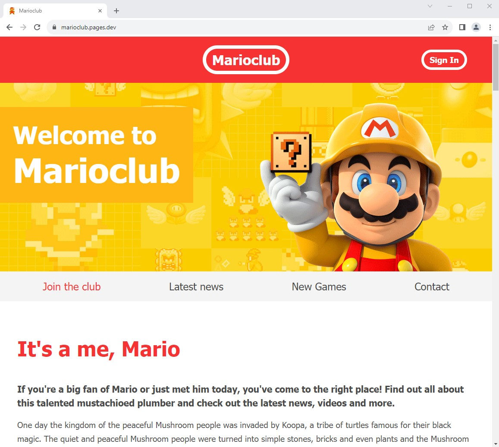
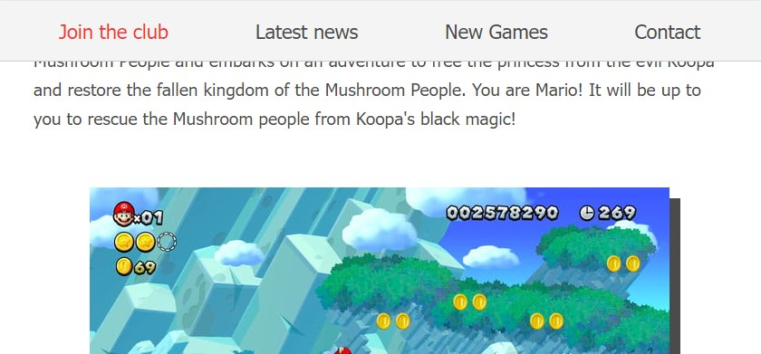

# [Marioclub](https://marioclub.pages.dev) 

 

 

 

# Responsive design adaptable to any screen size

 

 

 

## Features implemented in the website

- Implemented navigation menu using CSS Flexbox.

- Improved the navigation menu by adding a dropdown mobile menu.

- Implemented news and a games section using CSS Grid.

- Sign in/Sign up sections that only send data when the form is valid.

- Contact section than only sends data when the form is valid.

- Included animations for screenshot images, news and game sections.

- Smooth navigation scroll.

